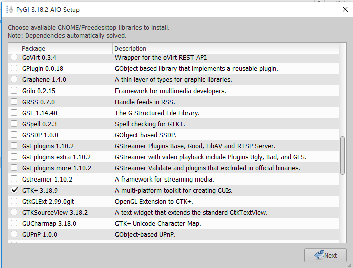
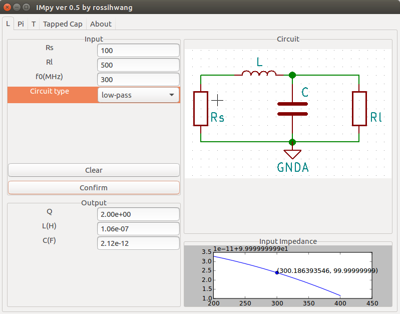
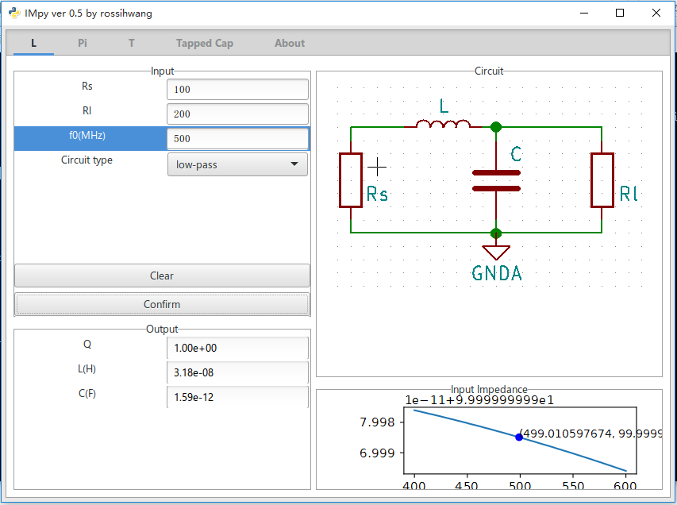
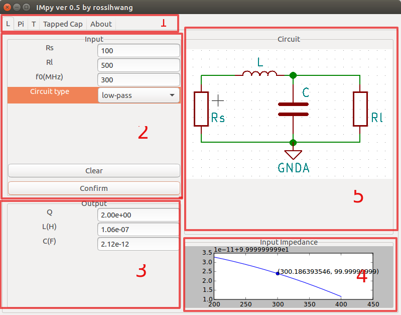

# IMpy
An impedance matching software python implementation

## 1. Introduction 

IMpy is a software to help users to determine the parameters of the impedance matching circuit. It is written in pure python and the GUI is based on GTK 3.0. 


## 2. Dependencies

* Python 3 (my environment is Python 3.5.2 under Ubuntu 16.04 LTS)

* GTK 3.0

* numpy

* matplotlib

* [ahkad]( https://github.com/ahkab/ahkab)  many thanks to this project, it's much easy to use than PySpice :)

  ​

## 3. Installion
### 3.1 Linux(Ubuntu)

Python 3 is installed by default in almost all of Linux distributions. 

#### 3.1.1 Install GTK 3.0 and python binding

Basically the GTK 3.0 is installed by default in Ubuntu, we just need to install the Python binding.

```shell
sudo pip3 install  pygobject
```

#### 3.1.2 Install numpy, matplotlib and ahkad

```shell
sudo pip3 install numpy matplotlib ahkad
```

#### 3.1.3 Clone the code

```shell
git clone git@github.com:rossihwang/IMpy.git
```

#### 3.1.4 Run the software

```
cd IMpy
./IMpy
```


### 3.2 Windows

#### 3.2.1 Install Python 3

Download binary installation package for Windows from [Link](https://www.python.org/), and install it. Refer to [this](https://sourceforge.net/projects/pygobjectwin32/), Python version should be lower than or equal to 3.4. I recommend to install 3.4. After installing Python, you may need to add the executable file path to the environment variable. 


#### 3.2.2 Install GTK 3.0 and python binding

Instead of the instruction on the official website, I recommend to install the all-in-one package from this [Link](https://sourceforge.net/projects/pygobjectwin32/ all in one package).

Remember to choose GTK on this page.




#### 3.2.3 Install numpy, matplotlib and scipy...

Install this packages in Windows is much difficult than in Linux. I recommend using the binary packages from this [Link](http://www.lfd.uci.edu/~gohlke/pythonlibs/)

According to the instructions, numpy-1.11+mkl and Visual C++ 2000 need to be installed at first. And then download and install the other packages.

For example, if you already install Python 3.4 in 64-bit system, following packages you will need to install.

```shell
numpy-1.11.3+mkl-cp34-cp34m-win_amd64.whl
vcredist_x64.exe
scipy-0.19.0-cp34-cp34m-win_amd64.whl
sympy-1.0-py2.py3-none-any.whl
matplotlib-2.0.0-cp34-cp34m-win_amd64.whl
```

For the whl package, you need to run the command line as Administrator. Then use this command to install it.

```shell
pip3 install xxx.whl
```


#### 3.2.4 Install ahkab

For some reasons, I can't use pip to install ahkad in my virtual machine. but you may try this

```shell
pip3 install ahkad
```

otherwise, you need to git clone the code from this [Link](https://github.com/ahkab/ahkab). Then

```shell
cd ahkab
python install setup.py
```


#### 3.2.5 Get the IMpy

You can download the zip file from the project [page](https://github.com/rossihwang/IMpy), In addition, you can git to clone, if you have git on hand.

If lucky, now you can run the software by

```shell
python IMpy.py
```


## 4. Screen shot

Screen shot in Ubuntu 16.04 LTS




Screen shot in Windows 10




## 5. How to use



* Area 1, you can choose four types of  matching network. there is no "Shunt L" or "Serial L", because the software will choose for you according to Rs and Rl input value.
* Area 2, you can input the parameters, then click the confirm button to calculate.
* Area 3, this area will give out the result after calculation.
* Area 4, after calculation the software will simulate the input impedance and give out the result in this area.
* Area 5, the specific circuit will be shown here, the parameters of the components you can find in area 3.

 

## 6. Useful Resources

* [Manual for GTK](https://lazka.github.io/pgi-docs/Gtk-3.0/index.html)
* [Integrated matplotlib in GTK](http://gtk3-matplotlib-cookbook.readthedocs.io/en/latest/hello-plot.html)